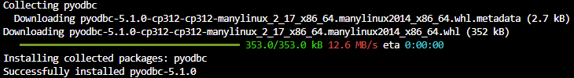

## pyodbc 
Pyodbc '(Python-SQL Server Connector) es un módulo Python de código abierto que nis oermite conectarnos a bases de datos SQL mediante conrtoladores ODBC. Actualmente 
[microsoft](https://www.microsoft.com/en-us/sql-server/blog/2016/12/09/sql-server-python-whats-new/) ofrece soporte. Se puede encontrar la documentacion oficial del proyecto en el repositorio del proyecto en [Github](https://github.com/mkleehammer/pyodbc/wiki).

Para realizar la instalacion usando el controlador de paquetes de pip usamos el siguiente comando en consola:

```
pip install pyodbc
```


