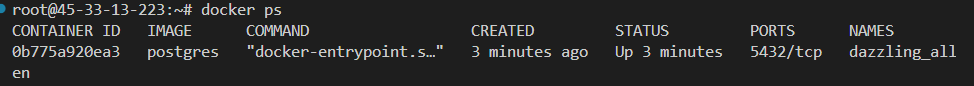
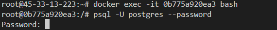

# Docker

## Primeros comandos:

Conocer los contenedores excistentes
```
docker ps
```
Conocer
| Comando           | Accion | Ejemplo|
|-------------------|--------|--------|
|``` docker ps ```   | Conocer los contenedores existentes | |
|``` docker stats```| Conocer el manejo de recusos de los contenedores| |

### Crear un conenedor a partir de una imagen en [Docker Hub](https://hub.docker.com/)


### Ejemplo: Postgres en Docker

0. Intalar la imagen de postgres 
```
docker pull postgres
```
Al ser postgres un sistema de bases de datos, se requiere de un usuario  y contraseña al momento de construir el contenedos, el usuario por defecto es postgres, mientras que la contraseña debe de ser registrada de manera obligatoria
```
docker run -e POSTGRES_PASSWORD=password postgres
```
2. Acceder al contenedor

En una nueva terminal el primer paso e conocer el nombre que se le ha asignado a nuestro contenedor, para ello hacemos uso del comando ``` docker ps ```, lo cual nos genera un listado de las imagenes activas

Una vez conocemos el nombre y el id del contenedor, procedemos a acceder a este contenedor con la siguiente linea de comandos

```
docker exec -it 0b775a920ea3 bash
```
* > *docker excet* es para ejecutar el comando
* > *-it* es para acceder al modo interactivo
* > *0b775a920ea3* es el id asignado al conentedos
* > *bash* es para hacerle saber al programa que usaremos codigo de bash.

3. Acceder a Postgres
Una vez accedemos al contenedor con la imagen de postgres, nos conectamos a la base de datos mediante el siguiente comando:
``` psql -U postgres --password ```. Como se muestra en la siguiente imagen:


* > *psql* permite conectarse a Postgres
* > *-U*  indica que nos conectaremos mediante un usuario, en este caso como no modificamos el nombre del mismo, por defaul es *postgres*
** > ***password* indica que a continuacion proporcionaremos la contraseña.

Se ingresa la contraseña que se genero al inicar el conenedor (en el paso anterior)